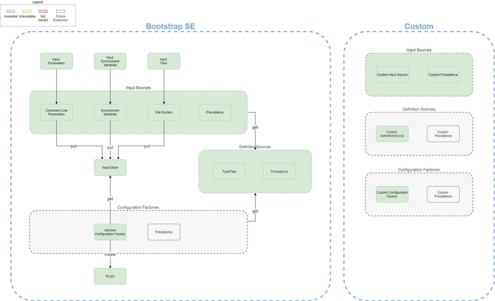

# Concepts
Below you can find a high-level overview of concepts used within Serpentes.
Detailed descriptions of individual concepts can be found on their respective pages which are referenced on this page.

## Overview
Consider the following image representing most of the important concepts within Serpentes.

In the image you can see there are a fair amount of concepts so let's explore them and their relations in order of importance.

## Definition Sources
Serpentes uses [definition-sources](./definition/sources.md) to retrieve a type-definition from a desired source (e.g. the file-system).
By properly configuring a definition-source a user can indicate at which locations a definition-source should search for a type-definition.
Once a definition-source has found a potential type-definition at a configured location it can attempt to convert that potential type-definition to a type-tree using [definition-parsers](./definition/parsers.md).

## Definition Parsers
Serpentes uses [definition-parsers](./definition/parsers.md) to convert strings to [type-trees](./definition/type-trees.md). 
A definition-parser attempts to parse a string, based on the format it can recognize.
For example, a definition-parser could attempt to parse a string based on the structure of XSD- or json-schemas.
If a definition-parser is able to parse a string correctly, it will return a type-tree representing the type-definition from the string it has parsed.

## Type Trees
Serpentes uses [type-trees](./definition/type-trees.md) as an intermediate representation of a type-definition.
Type-trees are intended to abstract details of type-definitions and provide a common interface to interact with them.
This interface can be used by [input-sources](./input/sources.md) to retrieve and store input for use by [configuration-factories](./consolidation/factories.md).

## Input Sources
Serpentes uses [input-sources](./input/sources.md) to retrieve input from a desired source (e.g., the file-system, environment variables, command-line parameters).
To retrieve the input an input-source can use a type-tree to determine where to look for input. 
For example, the environment variables input-source uses the key-names from a map/object declared in a type-definition such as a schema to derive environment-variable key-names and, retrieve the associated input-value.
When an input-source has obtained the input it may attempt to parse the input using [input-parsers](./input/parsers.md) and then store the input as [input-trees](./input/trees.md) in an [input-store](consolidation/store.md).

## Input Parsers
Serpentes uses [input-parsers](./input/parsers.md) to parse input strings and generate [input-trees](./input/trees.md).
An input-parser attempts to parse a string, based on the type of data-format it can recognize.
For example, an input-parser may be able to recognize yaml, xml and/or json. If an input-parser is able to parse the string correctly it will return an [input-tree](./input/trees.md).

## Input Trees
Serpentes uses [input-trees](./input/trees.md) as an intermediate data-type to hold any type of input.
Input-trees abstract details from data-formats and provide an interface to interact with input.
This interface can be used by [input-sources](./input/sources.md) and [configuration-factories](./consolidation/factories.md) for storage or conversion of input to preferred data-types.

## Input Store
Serpentes uses an [input-store](consolidation/store.md) to map type-trees to input-trees. 
Each [input-source](./input/sources.md) stores the input they retrieve for a type(-tree) in an input-store.
The input-store can then be used by other [input-sources](./input/sources.md) to store additional input or by [configuration-factories](./consolidation/factories.md) to build the desired configuration instance.

## Configuration Factories
Serpentes uses [configuration-factories](./consolidation/factories.md) to build configuration from a given type-tree and associated input-tree.
The type of configuration that a factory builds is completely dependent on the implementation of the factory.
Serpentes does not care which kind of configuration type you wish to use. It can be a string, a map, a plain old object, anything.